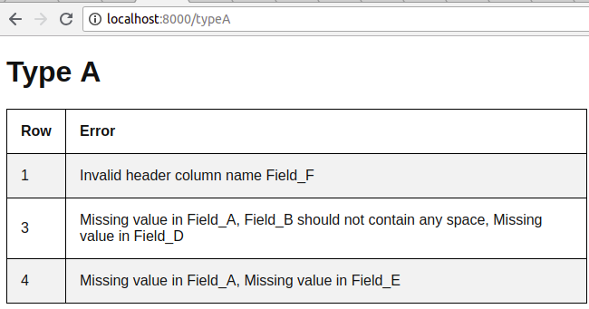
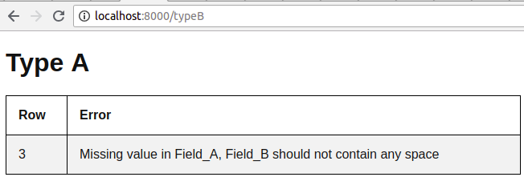
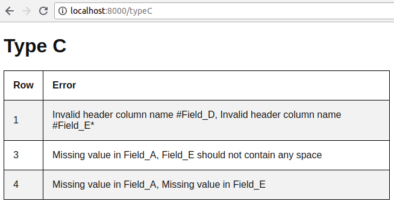

## PSR4 Package with PhpSpreadSheet Example

The purpose of PSR-4 is to specify the rules for an interoperable PHP autoloader that
maps namespaces to file system paths, and that can co-exist with any other SPL
registered autoloader. This would be an addition to, not a replacement for,
PSR-0.

The PhpSpreadsheet is a library written in pure PHP and providing a set of classes that allow you to read from and to write to different spreadsheet file formats, like Excel and LibreOffice Calc.

## Aims
This example aims to learn how to create PSR-4 autoloader in PHP, and some working with OOP in PHP.

## How To Create PSR-4 Package
So the first thing to do is to create a new directory on your computer that will hold all of the files. For the purpose of this tutorial I will call my package App.

The ``composer.json`` file defines meta data about the package. As you can see from the text above, we specify a name, description, license as well as who is responsible for the package.

The three most important sections of this file are ``require``, ``require-dev`` and ``autoload``.

**require** is where you list any dependencies that your package will require.

**require-dev** is where you list any dependencies that are required to develop your package. In this example I’ve listed PHPUnit which will be used for writing tests.

And finally, **autoload** specifies how your package should be autoloaded. Composer can handle autoloading your files, but you need to specify how you want it to work. In this example I’ve specified to use psr-4.

## About The Problem
This Problem to	validate excel file format and its data. For this exercise, you will have to validate two type of excel file Type_A and Type_B .

##### General Rules:
1. Column name that starts with # should not contain	any space.
2. Column name that	ends with  * is a required column, means it must have a value.
3. For each	file type, it should validate the header columns name and the amount of columns	it has
    - For example, Type_A file should only contains 5 columns and the header column name should be and follows the following order
        1. Field_A*
        2. #Field_B
        3. Field_C
        4. Field_D*
        5. Field_E*
4. The package should be able to validate both .xls and .xlsx file.

## Aims:
This problem aims to use PhpSpreadSheet in Laravel Framework and showing example of depedency injection that essentialy mean  class dependencies are "injected" into the class via the constructor or, in some cases, "setter" methods.

## Demo:

You can see three controllers TypeAController, TypeBController, and TypeCController and ExcelService under Services folder. Three controller uses one service injected by constructor in these controller. This is a depedency injection example, and in ExcelService File you can see an example of phpOffice/PhpSpreadSheet.

    
