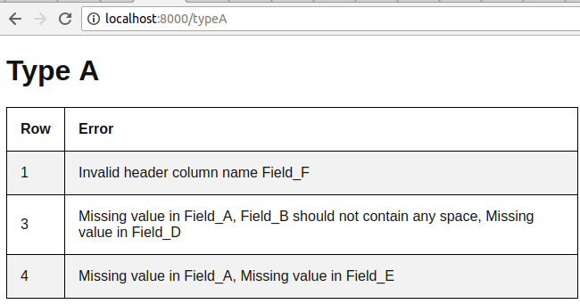

## PhpSpreadSheet with Laravel Example

Laravel is a web application framework with expressive, elegant syntax. We believe development must be an enjoyable and creative experience to be truly fulfilling. Laravel attempts to take the pain out of development by easing common tasks used in the majority of web projects.

The PhpSpreadsheet is a library written in pure PHP and providing a set of classes that allow you to read from and to write to different spreadsheet file formats, like Excel and LibreOffice Calc.

## About The Problem
This Problem to	validate excel file format and its data. For this exercise, you will have to validate two type of excel file Type_A and Type_B .

##### General Rules:
1. Column name that starts with # should not contain	any space.
2. Column name that	ends with  * is a required column, means it must have a value.
3. For each	file type, it should validate the header columns name and the amount of columns	it has
    - For example, Type_A file should only contains 5 columns and the header column name should be and follows the following order
        1. Field_A*
        2. #Field_B
        3. Field_C
        4. Field_D*
        5. Field_E*
4. The package should be able to validate both .xls and .xlsx file.

## Aims:
This problem aims to use PhpSpreadSheet in Laravel Framework and showing example of depedency injection that essentialy mean  class dependencies are "injected" into the class via the constructor or, in some cases, "setter" methods.

## Demo:
In this project we have three controllers and one service to validate Excel file  with the general rule above. This files architecture under app folder.
```bash
├── Console
│   └── Kernel.php
├── Exceptions
│   └── Handler.php
├── Http
│   ├── Controllers
│   │   ├── Auth
│   │   │   ├── ForgotPasswordController.php
│   │   │   ├── LoginController.php
│   │   │   ├── RegisterController.php
│   │   │   └── ResetPasswordController.php
│   │   ├── Controller.php
│   │   ├── TypeAController.php
│   │   ├── TypeBController.php
│   │   └── TypeCController.php
│   ├── Kernel.php
│   └── Middleware
│       ├── CheckForMaintenanceMode.php
│       ├── EncryptCookies.php
│       ├── RedirectIfAuthenticated.php
│       ├── TrimStrings.php
│       ├── TrustProxies.php
│       └── VerifyCsrfToken.php
├── Providers
│   ├── AppServiceProvider.php
│   ├── AuthServiceProvider.php
│   ├── BroadcastServiceProvider.php
│   ├── EventServiceProvider.php
│   ├── ExcelServiceProvider.php
│   └── RouteServiceProvider.php
├── Services
│   └── ExcelService.php
└── User.php

```
You can see three controllers TypeAController, TypeBController, and TypeCController and ExcelService under Services folder. Three controller uses one service injected by constructor in these controller. This is a depedency injection example, and in ExcelService File you can see an example of phpOffice/PhpSpreadSheet.

to see the demo type these commands below:
```
cd /path/of/this/project
composer install
php artisan serve
```
open the browser and visit three routes to check validation files put inside storage/public folder
```
http://localhost:8000/typeA
http://localhost:8000/typeB
http://localhost:8000/typeC
```




    
